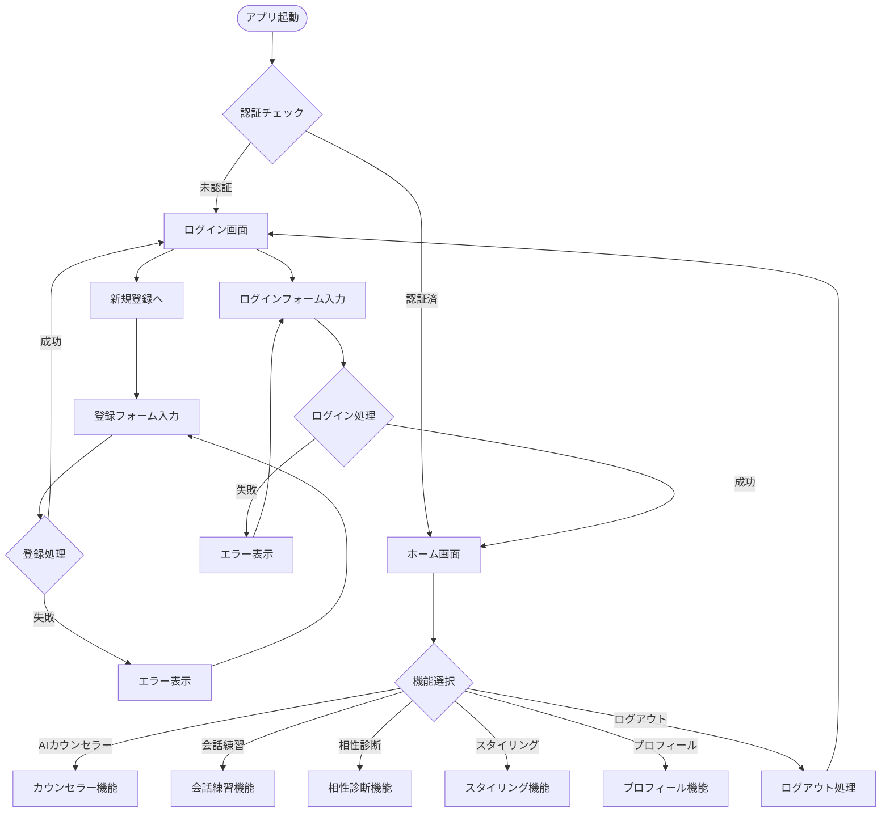
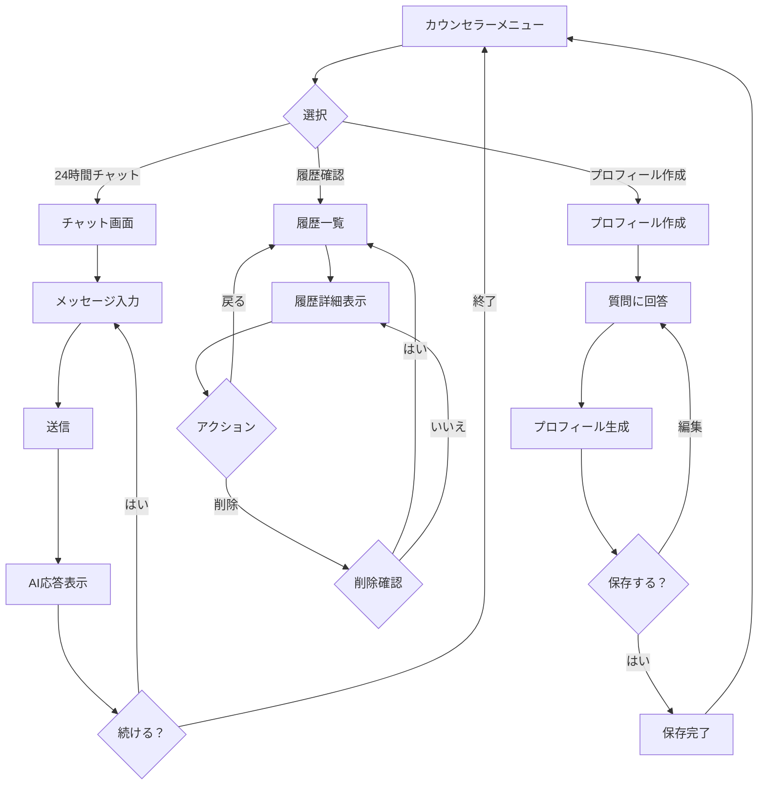
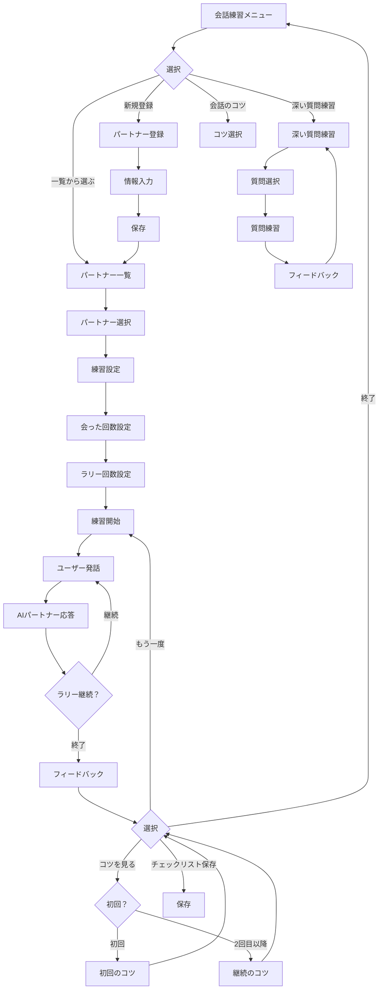
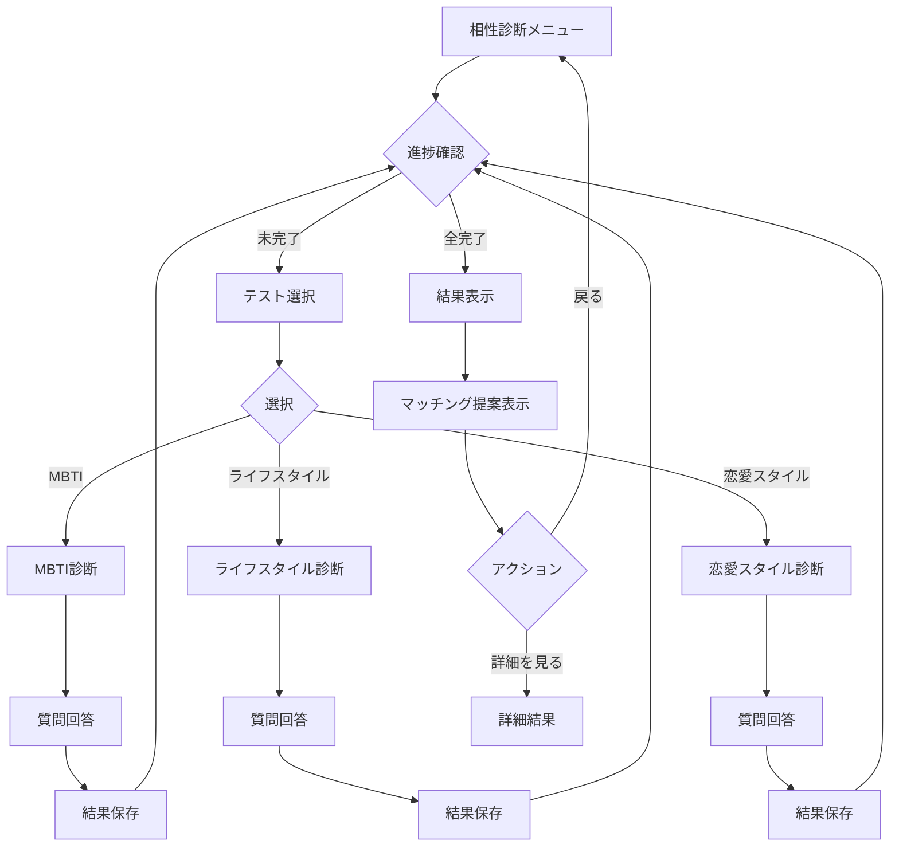
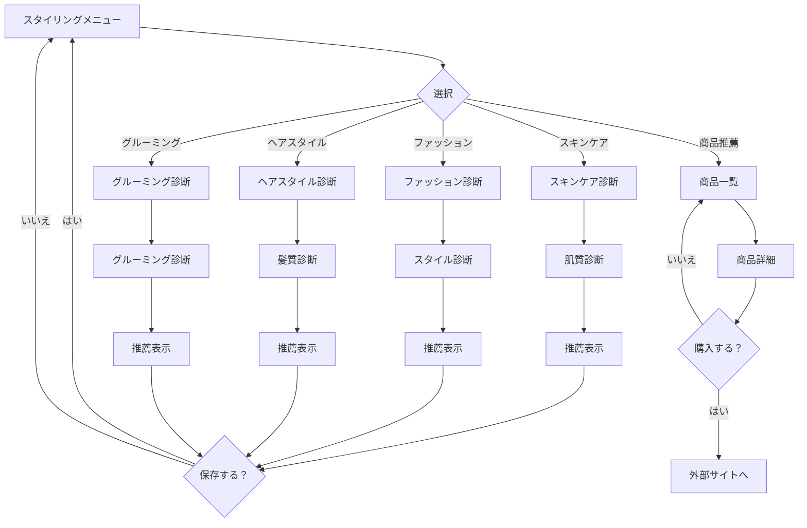

# 画面フロー図（アクティビティ図）

## 全体アクティビティ図

## AIカウンセラー機能フロー

## 会話練習機能フロー

## 相性診断機能フロー

## スタイリング機能フロー

## 主要な画面遷移パターン

### 1. 認証ゲート
- すべての機能ページで認証チェック
- 未認証時は自動的にログイン画面へリダイレクト
- トークン有効期限切れも同様の処理

### 2. 階層的ナビゲーション
- ホーム画面がハブとなる構造
- 各機能は独立したフローを持つ
- 戻るボタンで前の画面へ

### 3. 状態保持
- URLパラメータで状態を保持（partnerId、meetingCount等）
- 複雑なフローでもコンテキストを維持
- ディープリンク対応

### 4. プログレッシブディスクロージャー
- 相性診断は全テスト完了で結果表示
- 会話練習は回数によってコツの内容が変化
- ユーザーの進捗に応じた表示制御