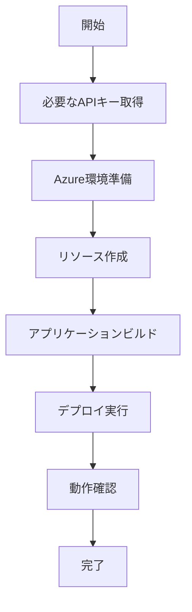

# 🚀 Miraim Azure デプロイメントガイド

このディレクトリには、MiraimアプリケーションをAzureにデプロイするために必要なすべてのドキュメントが含まれています。

## 📚 ドキュメント一覧

### 1. [必要なAPIキー・環境変数ガイド](./required-api-keys-guide.md)
**最初に読むべきドキュメント**
- 必要なAPIキーとサービスの一覧
- OpenAI APIキーの取得方法
- 環境変数の設定方法
- セキュリティのベストプラクティス

### 2. [Azure デプロイメント完全ガイド](./azure-deployment-guide.md)
**ステップバイステップのデプロイ手順**
- Azureリソースの作成手順
- Container Apps環境のセットアップ
- データベースの構築
- アプリケーションのデプロイ方法

### 3. [クイックスタートガイド](./quick-start.md)
**最速でデプロイしたい方向け**
- 必要最小限の手順
- コピペで実行できるコマンド集
- トラブルシューティング

## 🎯 デプロイの流れ



## ✅ デプロイ前チェックリスト

### 必須要件
- [ ] Azureアカウント作成済み
- [ ] Azure CLI インストール済み
- [ ] Docker Desktop インストール済み
- [ ] OpenAI APIキー取得済み
- [ ] Git クローン完了

### 推奨要件
- [ ] Node.js 18+ インストール済み
- [ ] Python 3.11+ インストール済み
- [ ] VSCode または好みのエディタ準備

## 💰 コスト見積もり

| リソース | 月額費用（目安） |
|---------|---------------|
| Container Apps | ¥2,000-3,000 |
| MySQL Database | ¥2,000-3,000 |
| Container Registry | ¥500 |
| Log Analytics | ¥500 |
| OpenAI API | ¥3,000-5,000 |
| **合計** | **¥8,000-12,000** |

※1000ユーザー/月を想定した概算

## 🔧 必要なツールのインストール

### Mac
```bash
# Homebrew インストール（未インストールの場合）
/bin/bash -c "$(curl -fsSL https://raw.githubusercontent.com/Homebrew/install/HEAD/install.sh)"

# Azure CLI
brew update && brew install azure-cli

# Docker Desktop
brew install --cask docker

# Node.js（nodenvを使用）
brew install nodenv
nodenv install 18.17.0
nodenv global 18.17.0
```

### Windows
```bash
# Azure CLI
winget install -e --id Microsoft.AzureCLI

# Docker Desktop
winget install -e --id Docker.DockerDesktop

# Node.js
winget install -e --id OpenJS.NodeJS.LTS
```

### Linux (Ubuntu/Debian)
```bash
# Azure CLI
curl -sL https://aka.ms/InstallAzureCLIDeb | sudo bash

# Docker
sudo apt-get update
sudo apt-get install docker.io docker-compose

# Node.js
curl -fsSL https://deb.nodesource.com/setup_18.x | sudo -E bash -
sudo apt-get install -y nodejs
```

## 📞 サポート情報

### トラブルシューティング
1. 各ガイドのトラブルシューティングセクションを確認
2. Azure Portalでリソースの状態を確認
3. Container Appsのログを確認

### よくある質問

**Q: 最小限のコストで始めたい**
A: Container Appsのレプリカ数を1に、MySQLをB1msプランで開始してください。

**Q: OpenAI APIキーはどこで取得？**
A: [required-api-keys-guide.md](./required-api-keys-guide.md)に詳細な手順があります。

**Q: デプロイにどれくらい時間がかかる？**
A: 初回は環境構築含めて1-2時間、2回目以降は15-30分程度です。

**Q: 既存のAzureリソースを使いたい**
A: 環境変数を適切に設定すれば、既存のMySQL、Container Registry等を利用可能です。

## 🚀 さあ、始めましょう！

1. まず[必要なAPIキー・環境変数ガイド](./required-api-keys-guide.md)でAPIキーを準備
2. 次に[Azure デプロイメント完全ガイド](./azure-deployment-guide.md)の手順に従ってデプロイ
3. 困ったら[クイックスタートガイド](./quick-start.md)を参照

---

**重要**: 実際のAPIキーやパスワードは絶対にGitHubにコミットしないでください！